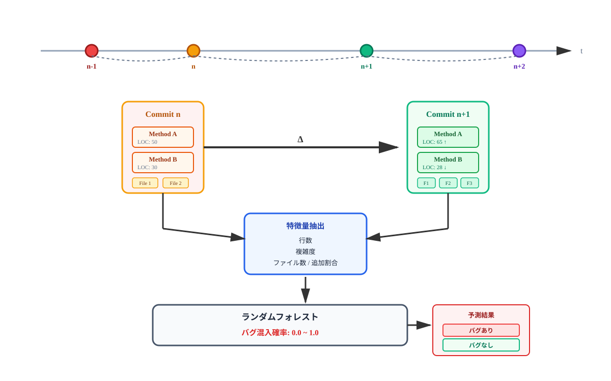

# コードの時系列変化を考慮した 機械学習に基づく欠陥混入の低減手法
<!--
_class: lead
_paginate: false
-->

鈴木研究室 2410064
笹川 尋翔

## 背景: ソフトウェア開発と欠陥混入リスク
* 段階的・反復的な開発手法の普及:
リリース後もソースコードの継続的かつ頻繁な変更が行われる
* ソフトウェア内の欠陥の発見が遅れた場合:
修正に必要な時間や労力は指数関数的に増大
* 76%の開発者: 変更作業による意図しないバグ混入のリスクを認識[1]

> [1] M. Kim et al., "An empirical study of refactoring challenges and benefits at microsoft," 2014

## 研究の目的: 意思決定支援モデルの構築
* レビュー労力を適切に配分する意思決定支援モデルを提示
  1. 複数の構成要素の活用:
  メソッド単位の局所的変化とコミット単位の全体的変化を考慮
  2. 不規則な時系列の考慮:
  コード変更を点過程データ*として扱い、それらの差分を学習
  3. 労力を考慮した欠陥予測:
  変更の規模や複雑さに着目した労力指標を定義し、欠陥発見率を向上

> *点過程データ: ある事象が発生した時刻などを記録したデータ

## 関連研究
* 制御フローの複雑さを測定する循環的複雑度[2]やコード行数などは静的な状態を示すに過ぎない
  - 本研究: コード変更を点過程データとして扱い、その変化量に着目する
* 変更メトリクスは強い予測因子[3]であるが、コード変更の不規則性は考慮されていない
  - 本研究: 複数の構成要素からコード変更を分析し、変更の勢いなどを推測
* 主要な欠陥予測研究[4]では、労力を変更行数のみから算出
  - 本研究: 変更行数、変更ファイル数、変更の分散度から労力を算出

> [2] T. J. McCabe, "A complexity measure," 1976
> [3] T. L. Graves et al., "Predicting fault incidence using software change history," 2000
> [4] Y. Kamei et al., "A large-scale empirical study of just-in-time quality assurance," 2013

## データ収集: BugHunterデータセットの活用
* 欠陥の混入から修正までの対応関係を特定可能なBugHunterデータセット[5]を使用
* データセットに収録されている活発なOSSプロジェクト5件を選定
* 統計的検定力を確保するため、解決済みのバグレポート数が多いプロジェクトを優先的に採用

<figure style="max-width: 60vw; display: block; margin: 0 auto;">
  
</figure>

> [5] R. Ferenc et al., "An automatically created novel bug dataset and its validation in bug prediction," 2020'

## 特徴量抽出: 時系列情報の活用
* 絶対値ではなく、直前の状態からの変化量に着目する
  - 例：現在の行数ではなく何行増えたか、構造がどれほど複雑化したかを重視
  - コミットを不規則に発生するイベントと定義し、発生タイミングが持つリスク情報を活用する

<figure style="max-width: 55vw; display: block; margin: 0 auto;">
  
</figure>

## 特徴量抽出: 複数要素の変更メトリクスの活用
* 局所的視点（メソッド単位）: コード行数、トークン数、循環的複雑度の各変化量を用いる
* 全体的視点（コミット単位）: 変更ファイル数、追加・削除行数、およびエントロピーを用いた変更の分散度を用いる

<figure style="max-width: 40vw; display: block; margin: 0 auto;">
  
</figure>

## メソッド識別子の処理
* 目的:
   機能を表す識別子は欠陥発生率と関連が深いため、これを特徴量化
* 手法:
  - キャメルケース等に基づき分解し、単語レベルでの類似性を認識可能に
  - 例：getUserName は user と name に分解
  - 頻出語を抑制しつつ、特定の機能を示す重要なキーワードに重みを付与し、汎化性能を高める

## 機械学習モデルの学習・評価
* ランダムフォレスト: 特徴量間の非線形な相互作用を捉え、予測結果の透明性に優れたアルゴリズム
* 交差検証: データの分割に依存しない頑健な性能評価を行う
* F1スコア、AUCによる評価: データの不均衡の影響を受けにくい指標
* McNemar検定:  既存手法との性能差の統計的有意性を確認

## 労力を考慮したレビュー優先度付け
* 少ない労力で高い欠陥発見率を達成できるレビュー対象の選定
  - 補正済みレビュー労力: 変更の規模と分散度を活用し、対数変換により巨大な変更の影響を緩和した指標を定義
    - $W_{i}=log_{2}(C_{i}\times N_{i}^{\overline{H}_{i}}+1)$
      - $C_{i}$: 変更行数
      - $N_{i}$: 変更ファイル数
      - $\overline{H}_{i}$: 変更の分散度
    - 貪欲法による求解: 単位労力あたりの欠陥混入確率が高い順に選定する
- Wilcoxonの符号順位検定: 既存手法との性能差の統計的有意性を確認

## 実験結果: 予測性能の向上
* 全てのプロジェクトで性能が向上し、F1スコアの平均改善幅は0.21を達成した
* 最終的なAUCは全プロジェクトで0.91を超え、高い識別能力を確認した

<table style="font-size: 2rem; margin: 0 auto;">
    <thead>
        <tr>
            <th>プロジェクト</th>
            <th>既存手法 (F1)</th>
            <th>提案手法 (F1)</th>
            <th>改善幅</th>
        </tr>
    </thead>
    <tbody>
        <tr>
            <td>Elasticsearch</td>
            <td style="text-align:right;">0.575</td>
            <td style="text-align:right;">0.767</td>
            <td style="text-align:right;">+0.192</td>
        </tr>
        <tr>
            <td>Hazelcast</td>
            <td style="text-align:right;">0.678</td>
            <td style="text-align:right;">0.790</td>
            <td style="text-align:right;">+0.112</td>
        </tr>
        <tr>
            <td>Neo4j</td>
            <td style="text-align:right;">0.478</td>
            <td style="text-align:right;">0.742</td>
            <td style="text-align:right;">+0.264</td>
        </tr>
        <tr>
            <td>Netty</td>
            <td style="text-align:right;">0.455</td>
            <td style="text-align:right;">0.747</td>
            <td style="text-align:right;">+0.292</td>
        </tr>
        <tr>
            <td>OrientDB</td>
            <td style="text-align:right;">0.483</td>
            <td style="text-align:right;">0.701</td>
            <td style="text-align:right;">+0.218</td>
        </tr>
    </tbody>
</table>

## 実験結果: 予測性能の向上
* 特徴量重要度の分析により、コミット単位の追加行数や変更ファイル数が特に予測に寄与することが判明した

<figure style="max-width: 50vw; display: block; margin: 0 auto;">
  
</figure>

## 実験結果: レビュー効率の改善
* 提案手法により、欠陥の70〜75%を20%のレビュー労力で特定
* 労力40%時点での欠陥発見率は平均87.0%に達し、既存手法（75.8%）から11.3%改善
* 労力40%時点において、既存手法に対し統計的に有意な改善を確認した

<figure style="max-width: 30vw; display: block; margin: 0 auto;">
  
</figure>

## 考察: プロジェクト特性と不均衡データ
* 構造的メトリクスのみでは予測が困難なプロジェクトほど、時系列変化情報の追加による改善幅が大きくなる
* 陽性クラスの割合が低いほど改善効果が顕著であり、変化の特徴が少数派の識別に有効に機能している
* 複数のドメイン（検索、DB、通信等）に対し、一貫して高い性能を発揮した

## 考察: 変更規模と欠陥混入確率の関連
* PDP分析により、変更規模が小さいほど欠陥混入確率が高いという傾向が観察された
* 要因の考察:
  1. 小規模な変更は部分的なバグ修正であることが多く、新たな不具合を誘発しやすい[6]
  2. 小規模な変更はレビューが容易なため、潜在的な欠陥が発見されやすく、記録に残る可能性が高い

> [6] Abram Hindle et al., "What do large commits tell us? a taxonomical study of large commits," 2008

## 評価と手法の制約
* 本研究は特定の言語（Java）のプロジェクトを対象としており、異なる言語特性への適用には再検証が必要である
  - 具体的には:
* 予測精度の最大化だけでなく、開発者がなぜ予測されたかを理解できる透明性を重視して構築した

## まとめ
* 複数の構成要素のメトリクスを活用することで、欠陥によるメトリクスの変化に敏感な欠陥モデルを構築した
* コミット間の不規則な変化を捉えることで、従来の静的な解析を上回る精度での予測を可能にした
* 労力を考慮したレビュー優先度付けにより、現実の開発環境において品質保証を効率化するモデルを提示した

## 変更目的の推定と欠陥予測の改善
* ToDo: 現在の提案手法と比較しても良い
* 変更規模だけでなく、機能追加やリファクタリングといった変更の目的と欠陥原因を関連付ける必要がある
* コミットメッセージ、コード構造、変更の文脈、開発者の変更履歴などの開発プロセスにかかわる情報を用いてモデルを構築する
* 欠陥が混入した原因を突き止めることで、具体的な予防ガイドラインの提示を目指す
