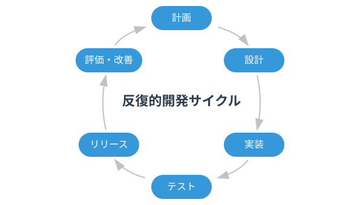
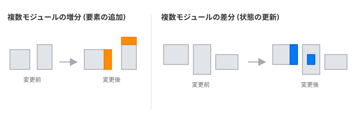
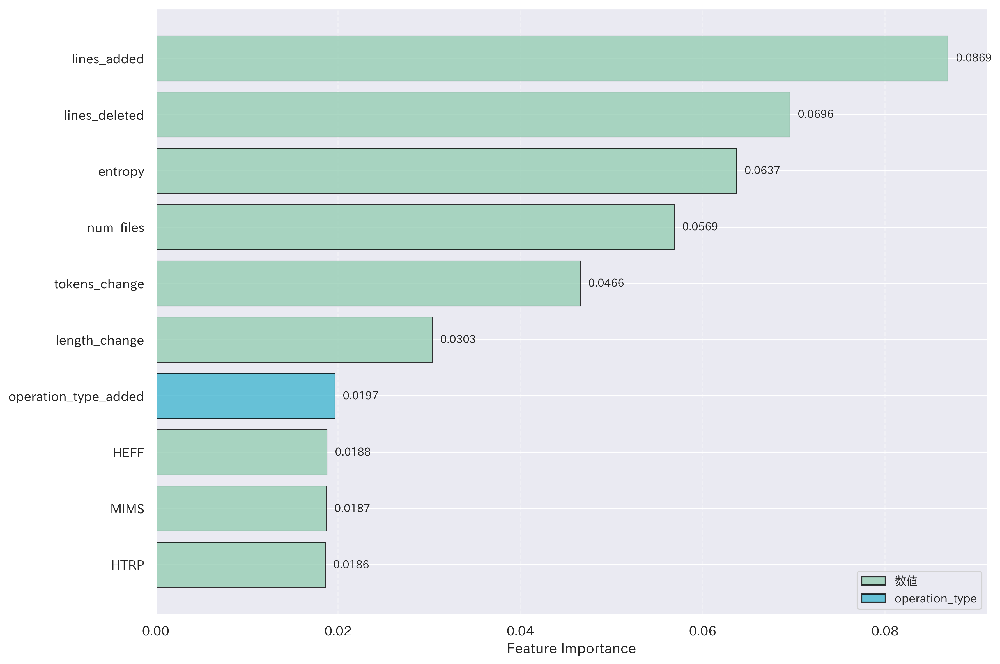
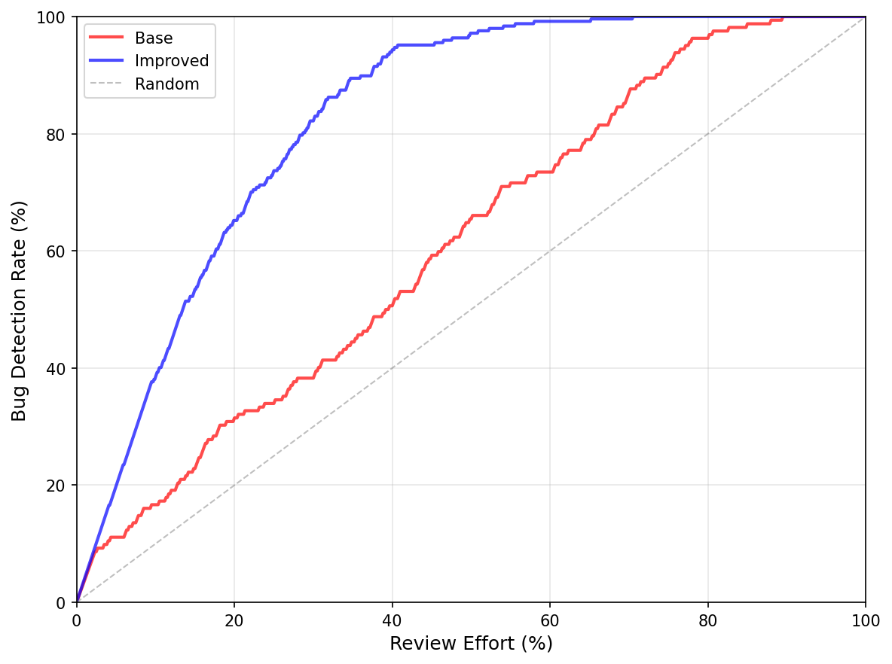
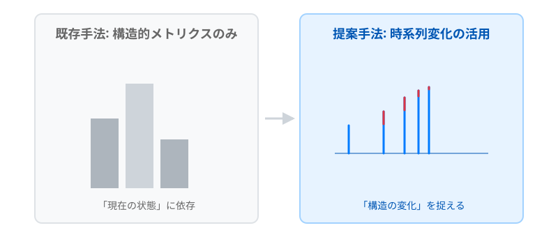
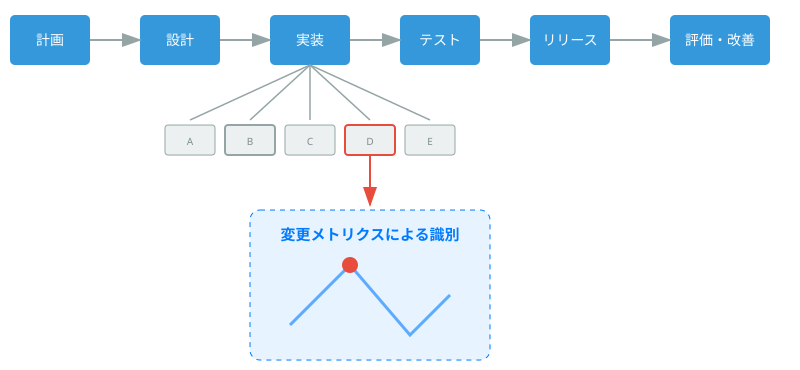
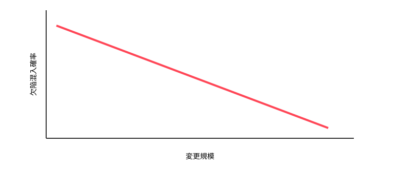

# コードの時系列変化を考慮した 機械学習に基づく欠陥混入の低減手法
<!--
_class: lead
_paginate: false
-->

鈴木研究室 2410064
笹川 尋翔

## 背景: 欠陥混入リスクとレビュー労力の関係
* 段階的・反復的な開発手法の普及:
リリース後もソースコードの継続的かつ頻繁な変更が行われる
* ソフトウェア内の欠陥の発見が遅れた場合:
修正に必要な労力は欠陥の影響範囲に応じて増大

<figure style="max-width: 45vw; display: block; margin: 0 auto;">
  
</figure>

## 研究の目的: 意思決定支援モデルの構築
* レビュー労力を減らす意思決定支援モデルを提示
  1. 複数の構成要素の活用:
  メソッド単位の局所的変化とコミット単位の全体的変化を考慮
  2. 不規則な時系列の考慮:
  コード変更を点過程データ*として扱い、それらの差分を学習
  3. 労力を考慮した欠陥予測:
  変更の規模や複雑さに着目した労力指標を定義し、欠陥発見率を向上

> *点過程データ: ある事象が発生した時刻などを記録したデータ

## 関連研究
* 循環的複雑度[1]は制御フローの複雑さを測定可能
* 変更メトリクスは欠陥予測に効果的[2]
* 主要な欠陥予測研究[3]では、コードの規模からレビュー労力を推定
* 本研究では:
  - コード変更を点過程データとして扱い、その変化量に着目
  - 複数の構成要素からコード変更を分析し、変更の勢いなどを推測
  - 変更行数、変更ファイル数、変更の分散度からレビュー労力を算出

> [1] T. J. McCabe, "A complexity measure," 1976
> [2] T. L. Graves et al., "Predicting fault incidence using software change history," 2000
> [3] Y. Kamei et al., "A large-scale empirical study of just-in-time quality assurance," 2013

## 1. データ収集
* 欠陥の混入から修正までの対応関係を特定可能なBugHunterデータセット[4]を使用
* データセットに収録されている活発なOSSプロジェクト5件を選定
* 統計的検定力を確保するため、解決済みのバグレポート数が多いプロジェクトを優先的に採用

<figure style="max-width: 70vw; display: block; margin: 0 auto;">
  
</figure>

> [4] R. Ferenc et al., "An automatically created novel bug dataset and its validation in bug prediction," 2020'

## 2. 特徴量抽出: 時系列情報の活用
* 絶対値ではなく、直前の状態からの変化量に着目する
  - 例：現在の行数ではなく何行増えたか、構造がどれほど複雑化したかを重視
  - コミットを不規則に発生するイベントと定義し、発生タイミングが持つリスク情報を活用

<figure style="max-width: 60vw; display: block; margin: 0 auto;">
  
</figure>

## 2. 特徴量抽出: 複数要素の変更メトリクスの活用
* 局所的視点（メソッド単位）: コード行数、トークン数、循環的複雑度の各変化量を用いる
* 全体的視点（コミット単位）: 変更ファイル数、追加・削除行数、およびエントロピーに基づく変更の分散度を用いる

<figure style="max-width: 75vw; display: block; margin: 0 auto;">
  
</figure>

## 3. メソッド識別子の処理
* 機能を表す識別子は欠陥発生率と関連が深いため、特徴量に変換
* 具体的には:
  - キャメルケース等に基づき分解し、単語レベルでの類似性を認識可能に
    - 例：getUserName は user と name に分解
  - 頻出語を抑制しつつ、特定の機能を示す重要なキーワードに重みを付与

## 4. モデルの学習・評価: 複数の決定木の構築
* 非線形な相互作用の抽出: 特徴量間の複雑な関係を学習可能
  * 例: 変更の規模が小さく、変更の分散度が大きい場合の欠陥混入リスク
* アンサンブル学習による安定性:
  * 予測結果を多数決で集約することで過学習を抑制
* モデルの説明可能性:
  * 特徴量重要度、Partial Dependence Plot:
    * どのメトリクスがどの程度予測に寄与したかを可視化

## 4. モデルの学習・評価: 不均衡データの評価
* 10分割交差検証
  * データを10グループに分割し、学習とテストを繰り返すことで、特定のデータ分割に依存しない性能を評価
  * 小さなデータセットにおいても信頼性の高い性能評価が可能
* F1スコア: 適合率と再現率の調和平均
  * 少数派クラス（欠陥を含むデータ）の識別性能を評価
* AUC（Area Under the Curve）
  * 分類のしきい値の変化に依存しないモデルの識別能力を評価

## 5. レビュー優先度付け: レビュー労力の推定
* 変更の規模だけでなく、変更の複雑さも加味した労力指標を定義
* 補正済みレビュー労力 $W_{i}$:
$$W_{i}=\log_{2}(C_{i}\times N_{i}^{\overline{H}_{i}}+1)$$
  * $C_{i}$: 変更行数（追加行数 + 削除行数）
  * $N_{i}$: 変更ファイル数
  * $\overline{H}_{i}$: 正規化された変更の分散度
  * 対数変換の導入: 変更の規模の違いによるレビュー労力の変化を抑制

## 5. レビュー優先度付け: レビュー優先度の判定
* 意思決定の考え方: 単位労力あたりの欠陥混入確率が高い箇所を優先
* 欠陥に関する密度 $D_{i}$:
$$D_{i}=\frac{\hat{y}_{i}}{W_{i}}$$
* $\hat{y}_{i}$: 機械学習モデルが予測した欠陥混入確率
* $W_{i}$: 補正済みレビュー労力

## 5. レビュー優先度付け: レビュー総労力の設定
* 総労力 $C_{total}$: 巨大なコミットを除外した、実質的なレビュー可能量
* 設定手順:
  1. 全コミットを補正済みレビュー労力 $W_{i}$ の昇順にソート
    2. 労力が小さい方から累計80%分のコミットを抽出
    3. 抽出されたコミットのレビュー労力の総和を $C_{total}$ とする

## 実験結果: 予測性能の向上
* 全てのプロジェクトで性能が向上し、F1スコアは平均0.21向上
* 最終的なAUCは全プロジェクトで0.91を超え、高い識別能力を確認

<table style="font-size: 2rem; margin: 0 auto;">
    <thead>
        <tr>
            <th>プロジェクト</th>
            <th>分野</th>
            <th>既存手法 (F1)</th>
            <th>提案手法 (F1)</th>
        </tr>
    </thead>
    <tbody>
        <tr>
            <td>Elasticsearch</td>
            <td>検索</td>
            <td style="text-align:right;">0.575</td>
            <td style="text-align:right;">0.767</td>
        </tr>
        <tr>
            <td>Hazelcast</td>
            <td>キャッシュ</td>
            <td style="text-align:right;">0.678</td>
            <td style="text-align:right;">0.790</td>
        </tr>
        <tr>
            <td>Neo4j</td>
            <td>グラフDB</td>
            <td style="text-align:right;">0.478</td>
            <td style="text-align:right;">0.742</td>
        </tr>
        <tr>
            <td>Netty</td>
            <td>ネットワーク</td>
            <td style="text-align:right;">0.455</td>
            <td style="text-align:right;">0.747</td>
        </tr>
        <tr>
            <td>OrientDB</td>
            <td>DB</td>
            <td style="text-align:right;">0.483</td>
            <td style="text-align:right;">0.701</td>
        </tr>
    </tbody>
</table>

## 実験結果: 予測性能の向上
* 特徴量重要度の分析により、コミット単位の追加・削除行数、メソッド単位のトークン数などが予測に寄与することが判明

<figure style="max-width: 50vw; display: block; margin: 0 auto;">
  
</figure>

## 実験結果: レビュー効率の改善
* 提案手法により、欠陥の70〜75%を20%のレビュー労力で特定
* 労力40%時点での欠陥発見率は平均87.0%、既存手法から11.3%改善
* 労力40%時点において、既存手法に対し統計的に有意な改善を確認した

<figure style="max-width: 35vw; display: block; margin: 0 auto;">
  
</figure>

## 考察: プロジェクト特性とドメインへの適応
* 構造的メトリクス（例: 複雑度や行数）のみでは予測が困難なプロジェクトほど、時系列変化情報の追加による改善幅が大きくなる傾向を確認
* 検索エンジン、データベース、通信プロトコルなどの異なるドメインに対し、高い予測性能を発揮

<figure style="max-width:55vw; display: block; margin: 0 auto;">
  
</figure>

## 考察: 不均衡データにおける予測モデルの挙動

* 欠陥データの割合が小さい → 提案手法による改善効果が大きい
* 変更メトリクスを用いることで、不均衡度が高いデータからも「欠陥を含む変更の特徴」を抽出できるようになる
* 時系列変化情報の導入により、欠陥混入の兆候を捉えやすくなる

<figure style="max-width:55vw; display: block; margin: 0 auto;">
  
</figure>

## 考察: 変更規模と欠陥混入確率の関連

* 変更規模が小さいほど欠陥混入確率が高いという傾向が観察された
  1. 暫定的なバグ修正が新たな不具合の原因になる[5]
  2. 小規模な変更はレビューが容易なため、欠陥が発見されやすく、記録に残る可能性が高い（欠陥密度 ≠ 欠陥混入数）

<figure style="max-width:50vw; display: block; margin: 0 auto;">
  
</figure>

> [5] Abram Hindle et al., "What do large commits tell us? a taxonomical study of large commits," 2008

## 評価と手法の制約
* 本研究は特定の言語（Java）のプロジェクトを対象としており、異なる言語特性への適用には再検証が必要
  - Java固有の言語特性:
  厳格なオブジェクト指向、静的型付けによるデータ型不整合の回避・冗長性
* ニューラルネットワークなどの大規模な機械学習手法よりも予測精度が低い
  - 予測精度の向上だけでなく、開発者が「なぜそのように予測されたか」を理解できる説明可能性も重視して構築したため

## まとめ
* 複数の構成要素のメトリクスを活用することで、欠陥によるメトリクスの変化に敏感な欠陥モデルを構築
* コミット間の不規則な変化を捉えることで、従来の静的な解析を上回る精度での予測を可能にした
* 労力を考慮したレビュー優先度付けにより、現実の開発環境において品質保証を効率化するモデルを提示

## 課題: 変更目的の推定による効果的な欠陥予測
* 変更規模だけでなく、機能追加やリファクタリングといった変更の目的と欠陥原因を関連付ける必要がある
* コミットメッセージ、コード構造、変更の文脈、開発者の変更履歴などの開発プロセスにかかわる情報を用いてモデルを構築
* 欠陥が混入した原因を突き止めることで、具体的な予防ガイドラインの提示を目指す
