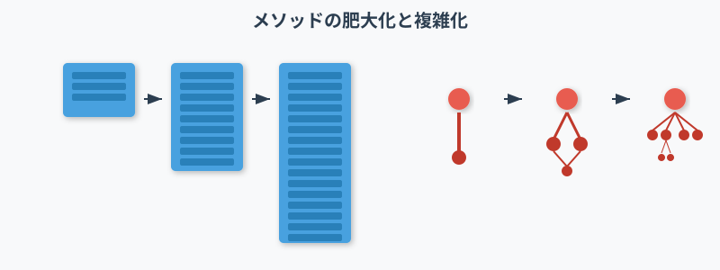

# コードの時系列変化を考慮した 保守性低下の要因分析と改善
<!--
_class: lead
_paginate: false
_header: ""
-->

鈴木研究室 2410064
笹川 尋翔

## 目次
1. 背景と関連研究
2. 目的
3. データ分析の流れ
4. 分析手法
5. 結果
6. 考察
7. 今後の見通し

# 1. 背景と関連研究
<!--
_class: lead
_paginate: false
-->

## 1.1 ソフトウェア開発における課題
<figure style="max-width: 50vw; display: block; margin: 0 auto;">
  
  <figcaption style="text-align: center; font-size: 2rem;">図1 メソッド構造の変化</figcaption>
</figure>

76%の開発者がリファクタリングによるバグ混入のリスクを認識 [1]

ソフトウェアの構造の変化に伴い、クラスや関数の理解が困難に

> [1] Microsoft Research, "An Empirical Study of Refactoring Challenges and Benefits at Microsoft"

## 1.2 関連研究
- レビューコメントを収集し、保守性の低下リスクを分析[2]
- 静的解析ツールを用いてコードの改善策を提示[3]
- コードメトリクスを用いたバグ予測により、コード品質を改善[4]

> [2] X.Han et al., "Understanding Code Smell Detection via Code Review: A Study of the OpenStack Community"
> [3] S.Romano et al., "Do Static Analysis Tools Affect Software Quality when Using Test-driven Development?"
> [4] R.Ferenc et al., "An automatically created novel bug dataset and its validation in bug prediction"

# 2. 目的
<!--
_class: lead
_paginate: false
-->

## 2 目的
- 時系列変化量を用いたバグ予測精度の向上
  - コードメトリクス（例: メソッドの複雑度・凝集度）の変化量を導入・分析
- バグの特徴とメトリクスの関係性の解明
  - バグの特徴を体系的に整理し、保守性とのつながりを明確化
  - バグの性質ごとにコードの改善策を示す

# 3. データ分析の流れ
<!--
_class: lead
_paginate: false
-->

## 3.1 概要
<figure style="max-width: 55vw; display: block; margin: 0 auto;">
  
  <figcaption style="text-align: center; font-size: 2rem;">図2 データ分析の流れ</figcaption>
</figure>

1. 時系列変化量を追加
2. テキストデータをカテゴリカル変数に変換
3. 特徴量の追加前と追加後のデータを用いて機械学習モデルを学習

## 3.2 時系列変化量の追加
<figure style="max-width: 35vw; display: block; margin: 0 auto;">
  
  <figcaption style="text-align: center; font-size: 2rem;">図3 ソフトウェア構造の変化</figcaption>
</figure>

- 単純な時系列データとして、コード行数・トークン数・循環的複雑度の変化量をデータセットに追加

## 3.2 カテゴリカル変数の導入
- クラスやメソッドの識別子を単語ごとに分解
  - 単語の出現率などの類似性に基づいて学習できるようにする
- メソッドに対する操作（例: 追加、削除）を表す変数を導入
  - 変化量が欠損値であったときに、その理由を説明できるようにする

## 3.3 機械学習モデルの構築
<figure style="max-width: 40vw; display: block; margin: 0 auto;">
  
  <figcaption style="text-align: center; font-size: 2rem;">図4 バグの2値分類の概要</figcaption>
</figure>

- 決定木を複数生成し、多数決で境界線を決定

# 4. 分析手法
<!--
_class: lead
_paginate: false
-->

## 4.1 プロジェクトの選定
<table style="font-size: 2rem; margin: 0 auto;">
  <caption>表1 選定したプロジェクト</caption>
  <thead>
    <tr>
      <th>プロジェクト</th>
      <th>役割</th>
    </tr>
  </thead>
  <tbody>
    <tr>
      <td>antlr4</td>
      <td>構文解析ツール</td>
    </tr>
    <tr>
      <td>BroadleafCommerce</td>
      <td>Webアプリフレームワーク</td>
    </tr>
    <tr>
      <td>ceylon-ide-eclipse</td>
      <td>IDEプラグイン</td>
    </tr>
    <tr>
      <td>elasticsearch</td>
      <td>全文検索エンジン</td>
    </tr>
    <tr>
      <td>hazelcast</td>
      <td>インメモリデータベース</td>
    </tr>
    <tr>
      <td>oryx</td>
      <td>機械学習フレームワーク</td>
    </tr>
  </tbody>
</table>

## 4.2 プロジェクトの分析
### 分析手順
1. 特徴量重要度（Feature Importance）を算出
2. ヒストグラムで特徴量分布を確認
3. Partial Depedence Plot（PDP）を用いて分類傾向を把握
4. 決定木で分類の流れを可視化し、判断の基準と信頼性を確認

# 5. 結果
<!--
_class: lead
_paginate: false
-->

## 5.1 特徴量重要度
<figure style="max-width: 35vw; display: block; margin: 0 auto;">
  
  <figcaption style="text-align: center; font-size: 2rem;">図5 hazelcastの特徴量重要度</figcaption>
</figure>

- トークン数・コード行数の変化量、Halsteadメトリクス、Maintainability Indexの重要度が高い

## 5.2 特徴量分布
<figure style="max-width: 45vw;　display: block; margin: 0 auto;">
  
  <figcaption style="text-align: center; font-size: 2rem;">図6 ceylon-ide-eclipseの特徴量分布</figcaption>
</figure>

- 変化量やHalstead系は分散が小さく、Maintainability Indexは 分散が大きい

## 5.3 PDP分析
<figure style="max-width: 45vw;　display: block; margin: 0 auto;">
  
  <figcaption style="text-align: center; font-size: 2rem;">図7 elasticsearchのPDP</figcaption>
</figure>

- ほとんどの特徴量において、陽性クラスの予測確率が0.5未満

## 5.4 決定木分析
<figure style="max-width: 45vw;　display: block; margin: 0 auto;">
  
  <figcaption style="text-align: center; font-size: 2rem;">図8 elasticsearchの決定木</figcaption>
</figure>

- 陰性クラスのノードのジニ不純度が比較的低い

## 5.5 評価指標の測定
<table style="font-size: 2rem; margin: 0 auto;">
  <caption>表2 評価指標の値の変化</caption>
  <thead>
    <tr>
      <th>プロジェクト</td>
      <th>F1スコア (変更前)</td>
      <th>F1スコア (変更後)</td>
    </tr>
  </thead>
  <tbody>
    <tr>
      <td>ceylon-ide-eclipse</td>
      <td>0.39</td>
      <td>0.49</td>
    </tr>
    <tr>
      <td>elasticsearch</td>
      <td>0.62</td>
      <td>0.72</td>
    </tr>
    <tr>
      <td>hazelcast</td>
      <td>0.67</td>
      <td>0.71</td>
    </tr>
    <tr>
      <td>antlr4</td>
      <td>0.45</td>
      <td>0.48</td>
    </tr>
    <tr>
      <td>oryx</td>
      <td>0.33</td>
      <td>0.39</td>
    </tr>
  </tbody>
</table>

モデルの予測性能が改善される傾向があることを確認

# 6. 考察
<!--
_class: lead
_paginate: false
-->

## 6 考察
### 陰性クラス予測の改善
リファクタリングによるメトリクスの減少傾向を確認できた

消去法的な分類がF1スコアの改善に寄与
### さらなる精度向上に向けて
PDPや決定木を見ると、陽性クラスの予測確率が低い

バグの混入理由が多様であることが影響している可能性

# 7. 課題と展望
<!--
_class: lead
_paginate: false
-->

## 7 課題と展望
### 陽性クラスの詳細な分類による因果関係の解明
バグ混入と保守性メトリクスの関連性が不明確であるため
### バグの体系的分類によるパターンの識別
Orthogonal Defect Classification（ODC）のような分析手法を活用

バグの特徴とコードメトリクスの時系列変化の関連性を示す

## まとめ
半数のプロジェクトで有意差があり、F1スコアが最大0.1向上

コードメトリクスの変化量を組み合わせることで、より効果的な バグ分類ができるようになった

今後は陽性クラスの分類精度を高め、品質改善に役立つコードの特徴を 捉えたい
