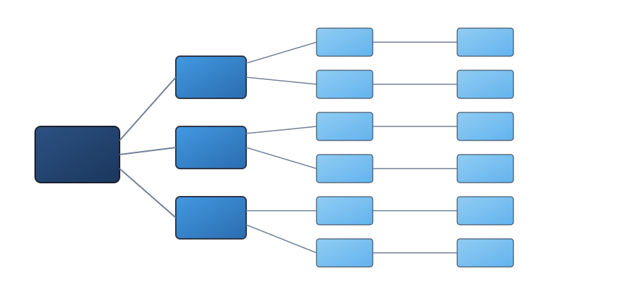
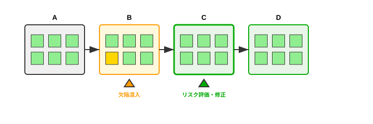
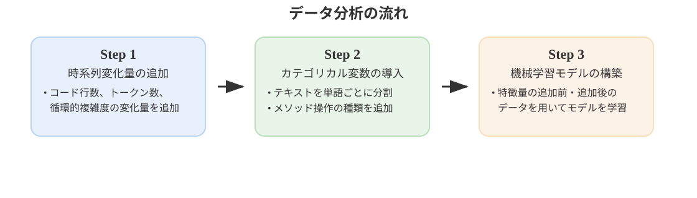
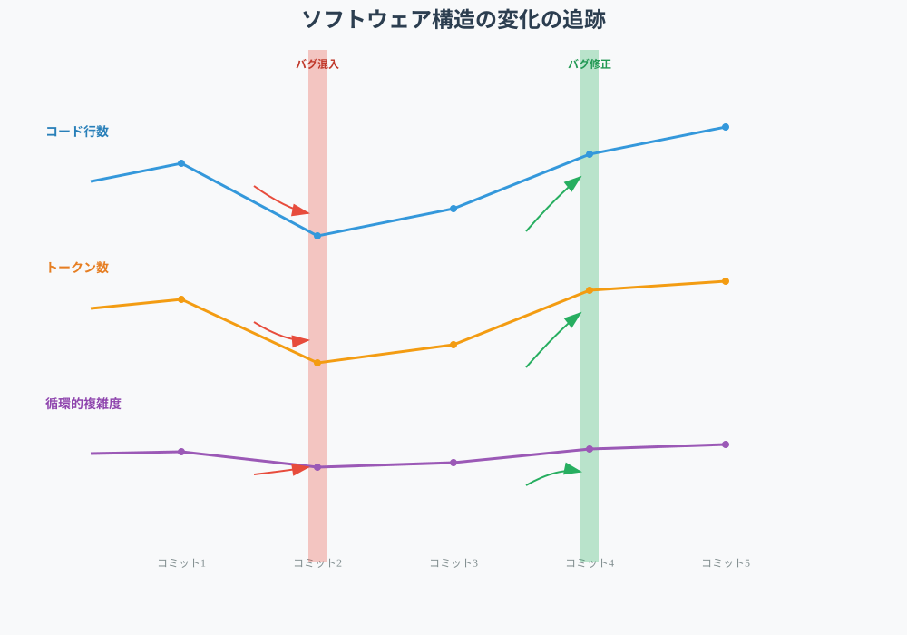
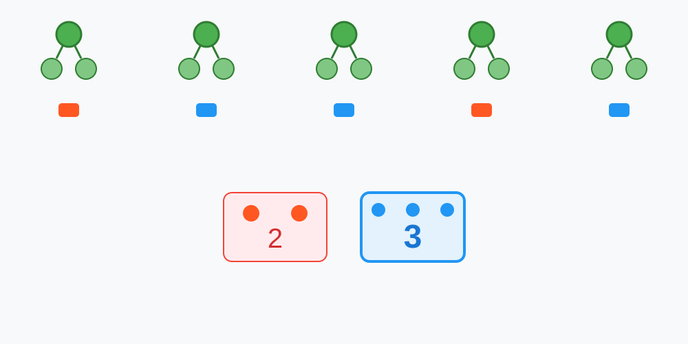
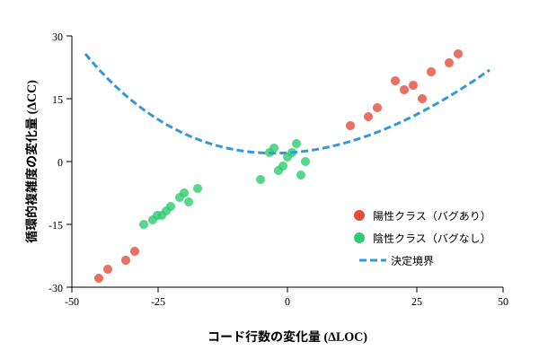
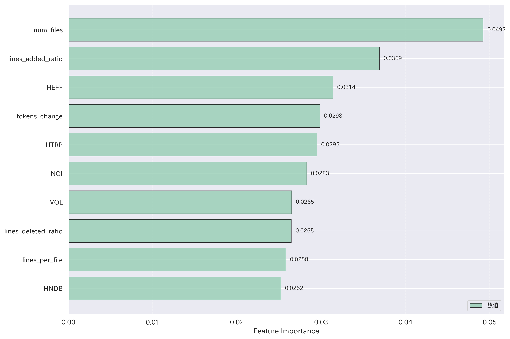
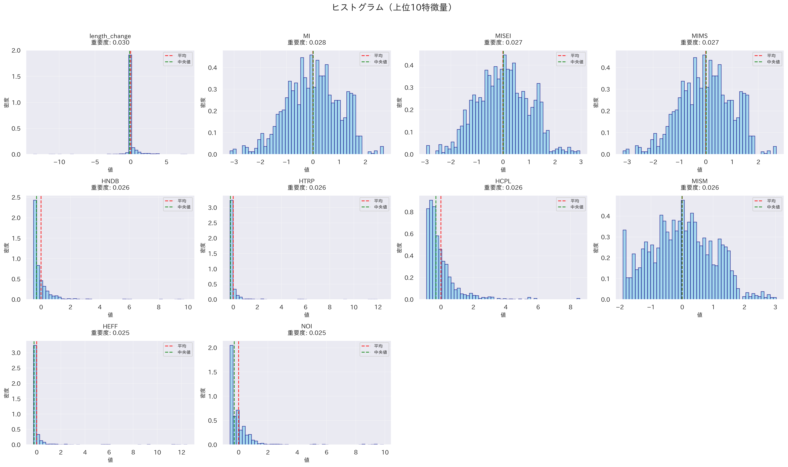
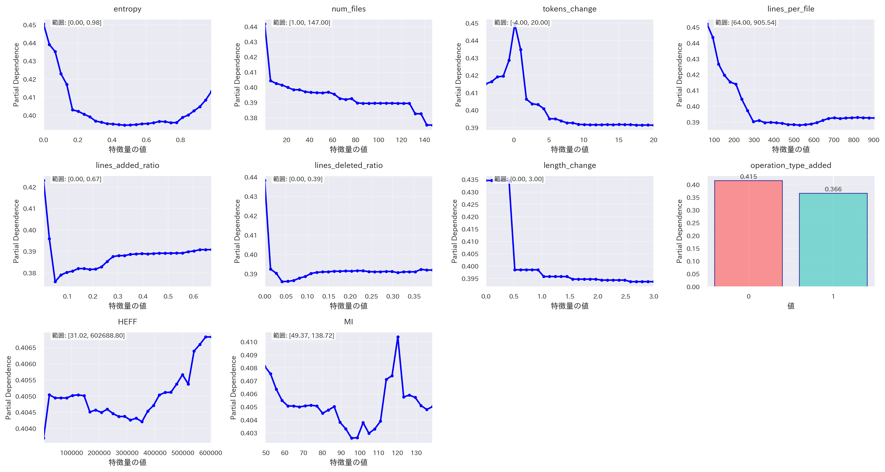
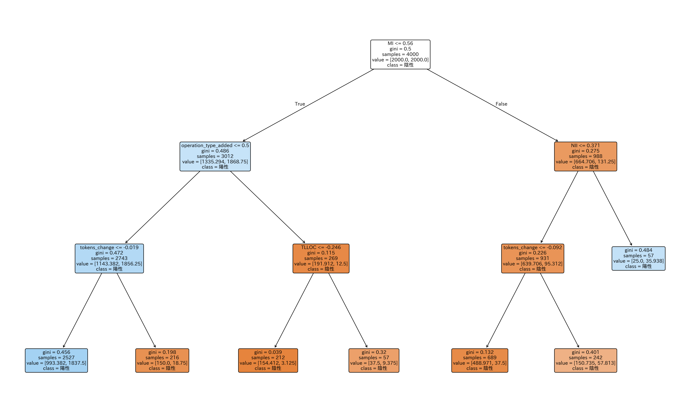

# コードの時系列変化を考慮した 保守性低下の要因分析と改善
<!--
_class: lead
_paginate: false
_header: ""
-->

鈴木研究室 2410064
笹川 尋翔

## 目次
1. 背景
2. 目的
3. 関連研究
4. 分析手順
5. ケーススタディ
6. 評価
7. 課題と展望

## 1. 背景
76%の開発者がリファクタリングによるバグ混入のリスクを認識 [1]

モジュール内部や外部の構造が変化し、静的分析では品質改善が困難に

<figure style="max-width: 50vw; display: block; margin: 0 auto;">
  
  <figcaption style="text-align: center; font-size: 2rem;">図1 欠陥の混入と顕在化</figcaption>
</figure>

> [1] Microsoft Research, "An Empirical Study of Refactoring Challenges and Benefits at Microsoft,"　2014

## 2. 目的
- ソフトウェアメトリクスの時間的変化を通じてバグ混入リスクを事前に特定
- 保守性の低下傾向を早期に検出し、バグが発生する前に対策を 講じるための情報を提供

<figure style="max-width: 50vw; display: block; margin: 0 auto;">
  
  <figcaption style="text-align: center; font-size: 2rem;">図2 欠陥の特定と修正</figcaption>
</figure>

## 3. 関連研究
- Hanらは、レビューの分析により欠陥の種類を調査したが、レビューのうち70%では明示的に欠陥が指摘されなかった[2]
- Romanoらは、静的なしきい値に基づいた警告が欠陥修正作業を効率化することを示したが、動的なしきい値については検証していない[3]

> [2] X.Han et al., "Understanding Code Smell Detection via Code Review: A Study of the OpenStack Community," 2021
> [3] S.Romano et al., "Do Static Analysis Tools Affect Software Quality when Using Test-driven Development?," 2022

## 3. 関連研究
- Ferencらは、コミットごとのソフトウェアメトリクスを用いて 欠陥予測を実施したが、メトリクスの変化量を導入しなかった[4]
- Kameiらは、コミットデータに基づく14の変更メトリクスを提案しているが、ソフトウェアメトリクスとの関連付けが不十分[5]

> [4] R.Ferenc et al., "An automatically created novel bug dataset and its validation in bug prediction," 2020
> [5] Y. Kamei et al., "A large-scale empirical study of just-in-time quality assurance," 2013

## 4. 分析手順
1. データセットを構築
2. ソフトウェアメトリクスの変化量を追加
3. 特徴量の追加前・追加後のデータを用いて機械学習モデルを訓練
4. 各プロジェクトでモデルの性能を評価

<figure style="max-width: 55vw; display: block; margin: 0 auto;">
  
  <figcaption style="text-align: center; font-size: 2rem;">図3 分析手順</figcaption>
</figure>

## 4.1 データセットの構築

## 4.2　ソフトウェアメトリクスの変化量を追加
<!-->ToDo: 変化量がどのように測定され（原因）、どのような結果になるのか（結果）を表す図に変更<-->

- 単純な時系列データとして、コード行数・トークン数・循環的複雑度の変化量をデータセットに追加

<figure style="max-width: 35vw; display: block; margin: 0 auto;">
  
  <figcaption style="text-align: center; font-size: 2rem;">図4 コードメトリクスの時系列変化</figcaption>
</figure>

## 4.3 機械学習モデルの訓練
<!-->ToDo: 手順を入力からより具体的に説明<-->

- 決定木を複数生成し、多数決で境界線を決定

  <figure style="margin: 0;">
    
    <figcaption style="text-align: center; font-size: 2rem;">図5 複数の決定木を用いた投票</figcaption>
  </figure>
  <figure style="margin: 0;">
    
    <figcaption style="text-align: center; font-size: 2rem;">図6 決定境界による2値分類</figcaption>
  </figure>

<!-->## ToDo: ケーススタディとして第5章として独立させる<-->
## 5.1 プロジェクトごとの性能評価
<!-->## ToDo: プロジェクトの規模の降順に並べる<-->
<!-->## ToDo: 5.1と5.2の順番を入れ替える<-->
<table style="font-size: 2rem; margin: 0 auto;">
  <caption>表1 選定したプロジェクト</caption>
  <thead>
    <tr>
      <th>プロジェクト</th>
      <th>コード行数 （概算）</th>
      <th>コミット数</th>
      <th>バグレポートの数</th>
    </tr>
  </thead>
  <tbody>
    <tr>
      <td>ANTLR v4</td>
      <td>68,000</td>
      <td>6,526</td>
      <td>179</td>
    </tr>
    <tr>
      <td>Broadleaf Commerce</td>
      <td>322,000</td>
      <td>14,920</td>
      <td>703</td>
    </tr>
    <tr>
      <td>Eclipse plugin for Ceylon</td>
      <td>181,000</td>
      <td>7,984</td>
      <td>923</td>
    </tr>
    <tr>
      <td>Elasticsearch</td>
      <td>995,000</td>
      <td>28,815</td>
      <td>4,494</td>
    </tr>
    <tr>
      <td>Hazelcast</td>
      <td>949,000</td>
      <td>24,380</td>
      <td>3,882</td>
    </tr>
    <tr>
      <td>Oryx</td>
      <td>34,000</td>
      <td>1,054</td>
      <td>67</td>
    </tr>
  </tbody>
</table>

## 5.2 プロジェクトごとの性能評価
1. 特徴量重要度（Feature Importance）を算出
2. ヒストグラムで特徴量分布を確認
3. Partial Depedence Plot（PDP）を用いて分類傾向を把握
4. 決定木で分類の流れを可視化し、判断の基準と信頼性を確認

## 5.3 特徴量重要度

- トークン数・コード行数の変化量、Halsteadメトリクス、Maintainability Indexの重要度が高い

<figure style="max-width: 35vw; display: block; margin: 0 auto;">
  
  <figcaption style="text-align: center; font-size: 2rem;">図7 Hazelcastの特徴量重要度</figcaption>
</figure>

## 5.4 特徴量分布

- 変化量やHalstead系は分散が小さく、Maintainability Indexは 分散が大きい

<figure style="max-width: 40vw;　display: block; margin: 0 auto;">
  
  <figcaption style="text-align: center; font-size: 2rem;">図8 Eclipse plugin for Ceylonの特徴量分布</figcaption>
</figure>

## 5.5 PDP分析

- ほとんどの特徴量において、陽性クラスの予測確率が0.5未満

<figure style="max-width: 45vw;　display: block; margin: 0 auto;">
  
  <figcaption style="text-align: center; font-size: 2rem;">図9 ElasticsearchのPDP</figcaption>
</figure>

## 5.6 決定木分析

- 陰性クラスのノードのジニ不純度が比較的低い

<figure style="max-width: 45vw;　display: block; margin: 0 auto;">
  
  <figcaption style="text-align: center; font-size: 2rem;">図10 Elasticsearchの決定木</figcaption>
</figure>

## 5.7 評価指標の測定
<table style="font-size: 2rem; margin: 0 auto;">
  <caption>表2 評価指標の値の変化</caption>
  <thead>
    <tr>
      <th>プロジェクト</td>
      <th>F1スコア (変更前)</td>
      <th>F1スコア (変更後)</td>
    </tr>
  </thead>
  <tbody>
    <tr>
      <td>Eclipse plugin for Ceylon</td>
      <td>0.39</td>
      <td>0.49</td>
    </tr>
    <tr>
      <td>Elasticsearch</td>
      <td>0.62</td>
      <td>0.72</td>
    </tr>
    <tr>
      <td>Hazelcast</td>
      <td>0.67</td>
      <td>0.71</td>
    </tr>
    <tr>
      <td>ANTLR v4</td>
      <td>0.45</td>
      <td>0.48</td>
    </tr>
    <tr>
      <td>Oryx</td>
      <td>0.33</td>
      <td>0.39</td>
    </tr>
  </tbody>
</table>

モデルの予測性能が改善される傾向があることを確認

## 6. 評価
## ToDo: 達成できたこととできなかったことを書く
### 陰性クラス予測の改善
リファクタリングによるメトリクスの減少傾向を確認できた

消去法的な分類がF1スコアの改善に寄与
### さらなる精度向上に向けて
PDPや決定木を見ると、陽性クラスの予測確率が低い

## 7. 課題と展望
## ToDo: 達成できなかったことへの対処法だけでなく、最終目的の達成に向けた道のりを書く
### 開発プロセスの定量的な分析
レビュー記録や自動テストの内容からバグが生じる状況を説明
### 陽性クラスの詳細な分類による因果関係の具体化
開発プロセスやコードメトリクスの変化がバグにどのように影響するかを 明らかにする

## まとめ
半数のプロジェクトで有意差があり、F1スコアが最大0.1向上

コードメトリクスの変化量を組み合わせることで、より効果的な バグ分類ができるようになった

今後は陽性クラスの分類精度を高め、品質改善に役立つ特徴を探す
