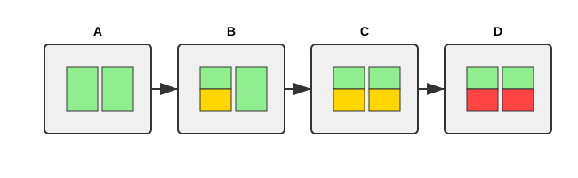
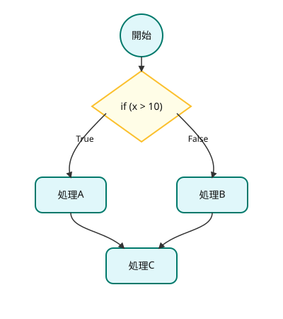
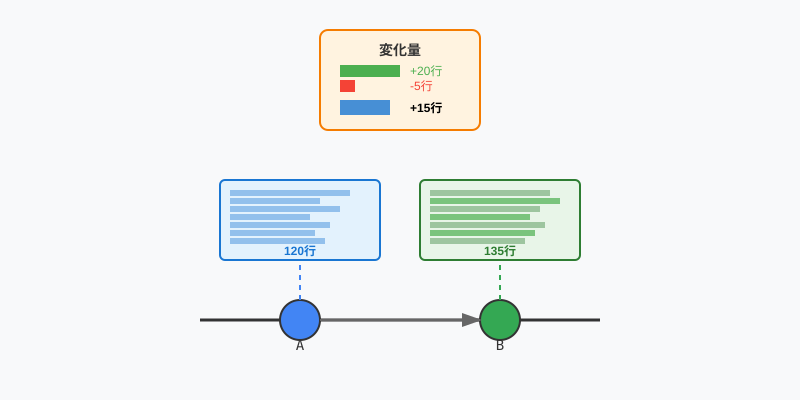
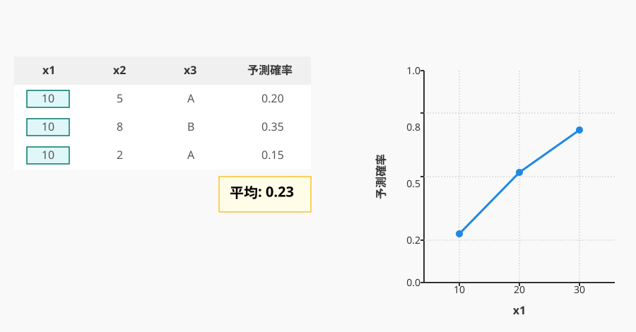

# コードの時系列変化を考慮した 保守性低下の要因分析と改善
<!--
_class: lead
_paginate: false
-->

鈴木研究室 2410064
笹川 尋翔

## 内容
1. 背景
2. 目的と手法
3. 関連研究
4. 分析手順
5. ケーススタディ
6. 評価
7. 課題と展望

## 1. 背景
76%の開発者がリファクタリングによるバグ混入のリスクを認識 [1]

モジュール内部や外部の構造が変化し、静的分析では品質改善が困難に

<figure style="max-width: 70vw; display: block; margin: 0 auto;">
  
</figure>

> [1] Microsoft Research, "An Empirical Study of Refactoring Challenges and Benefits at Microsoft,"　2014

## 2. 目的と手法
- 保守性の低下傾向を早期に検出し、バグが発生する前に対策を 講じるための情報を提供
  - ソフトウェア特徴量の時間的変化を通じてバグ混入リスクを事前に特定
<figure style="max-width: 70vw; display: block; margin: 0 auto;">
  
</figure>

## 3. 関連研究
- Hanらは、レビューテキストの自然言語処理により欠陥を調査[2]
  - およそ1,200件のうち、70%では明示的に欠陥が指摘されなかった
- Romanoらは、静的解析ツールを用いたコード分析が欠陥を減少させる ことを示した[3]
  - 文脈依存のしきい値については検証していない

> [2] X.Han et al., "Understanding Code Smell Detection via Code Review: A Study of the OpenStack Community," 2021
> [3] S.Romano et al., "Do Static Analysis Tools Affect Software Quality when Using Test-driven Development?," 2022

## 3. 関連研究
- Ferencらは、各コミットの特性値の欠陥予測を実施[4]
  - コミット間の変化量は対象外
- Kameiらは、コミット間の特性値に基づいて14の変更メトリクスを 提案[5]
  - 特性値同士の関連性を分析していない

> [4] R.Ferenc et al., "An automatically created novel bug dataset and its validation in bug prediction," 2020
> [5] Y. Kamei et al., "A large-scale empirical study of just-in-time quality assurance," 2013

## 4. 分析手順
1. データセットを構築
2. 特徴量の変化量を追加
3. 機械学習によるバグ予測精度向上のため、変化量の追加前・追加後の データを用いてモデルを訓練
4. モデルの性能を評価

## 4.1 データセットの構築
- Ferencらが作成した、コミットごと、ソフトウェアの構成要素ごとのメトリクスを含むデータセットを使用
  - 正解ラベル: メソッドに含まれるバグの数を二値化
  - 値が全て同じであるカラムを削除、メソッドの識別子をベクトルに変換

<table style="font-size: 2rem; margin: 0 auto;">
    <thead>
        <tr>
            <th>コミット</th>
            <th>メソッド名</th>
            <th>複雑度</th>
            <th>コード行数</th>
            <th>バグの数</th>
        </tr>
    </thead>
    <tbody>
        <tr>
            <td>A</td>
            <td>method_A</td>
            <td>8</td>
            <td>45</td>
            <td>2</td>
        </tr>
        <tr>
            <td>A</td>
            <td>method_B</td>
            <td>12</td>
            <td>67</td>
            <td>2</td>
        </tr>
        <tr>
            <td>B</td>
            <td>method_A</td>
            <td>8</td>
            <td>48</td>
            <td>1</td>
        </tr>
        <tr>
            <td>C</td>
            <td>method_B</td>
            <td>10</td>
            <td>63</td>
            <td>0</td>
        </tr>
    </tbody>
</table>

## 4.2　特徴量の変化量の追加
- コード行数・トークン数・循環的複雑度の変化量を追加
  - ソフトウェアのサイズが欠陥の有無に影響を与えるため

<figure style="max-width: 30vw; display: block; margin: 0 auto;">
  
</figure>

## 4.2　特徴量の変化量の追加
- **直前の**コミットとの差分を用いて変化量を計算

<figure style="max-width: 70vw; display: block; margin: 0 auto;">
  
</figure>

## 4.3 機械学習モデルの訓練
- 非線形な関係を捉えるため、ランダムフォレストを使用
- 決定木を用いたアンサンブル学習により高い精度を得られる

  <figure style="margin: 0;">
    
  </figure>
  <figure style="margin: 0;">
    
  </figure>

## 4.4　プロジェクト内評価
- F1スコア（適合率と再現率の調和平均）による評価を行う
  - F1スコア = 2 × (適合率 × 再現率) / (適合率 + 再現率)
  - Zhaoらによれば、欠陥予測ではF1スコアによる評価が効果的[6]
- 評価の確信度を測るために有意性検定を実施

> Y. Zhao et al., "A Systematic Survey of Just-in-Time Software Defect Prediction," 2023

## 5. ケーススタディ
- データセットから以下の6プロジェクトを選定
<table style="font-size: 2rem; margin: 0 auto;">
  <thead>
    <tr>
      <th>プロジェクト</th>
      <th>コード行数 （概算）</th>
      <th>コミット数</th>
      <th>バグレポートの数</th>
    </tr>
  </thead>
  <tbody>
    <tr>
      <td>Elasticsearch</td>
      <td style="text-align: right;">995,000</td>
      <td style="text-align: right;">28,815</td>
      <td style="text-align: right;">4,494</td>
    </tr>
    <tr>
      <td>Hazelcast</td>
      <td style="text-align: right;">949,000</td>
      <td style="text-align: right;">24,380</td>
      <td style="text-align: right;">3,882</td>
    </tr>
    <tr>
      <td>Broadleaf Commerce</td>
      <td style="text-align: right;">322,000</td>
      <td style="text-align: right;">14,920</td>
      <td style="text-align: right;">703</td>
    </tr>
    <tr>
      <td>Eclipse plugin for Ceylon</td>
      <td style="text-align: right;">181,000</td>
      <td style="text-align: right;">7,984</td>
      <td style="text-align: right;">923</td>
    </tr>
    <tr>
      <td>ANTLR v4</td>
      <td style="text-align: right;">68,000</td>
      <td style="text-align: right;">6,526</td>
      <td style="text-align: right;">179</td>
    </tr>
    <tr>
      <td>Oryx</td>
      <td style="text-align: right;">34,000</td>
      <td style="text-align: right;">1,054</td>
      <td style="text-align: right;">67</td>
    </tr>
  </tbody>
</table>

## 5.1 分析手法
1. 特徴量重要度（Feature Importance）を算出
2. ヒストグラムで特徴量分布を確認
3. Partial Depedence Plot（PDP）を用いて分類傾向を把握
4. 決定木で分類の流れを可視化し、判断の基準と確信度を確認

<figure style="max-width: 45vw; display: block; margin: 0 auto;">
  
</figure>

## 5.3 特徴量重要度

- コード行数・トークン数の変化量、Halsteadメトリクス、Maintainability Index（MI）の重要度が高い
  - MI: コード行数が多く循環的複雑度が高いほど、値が低くなる

<figure style="max-width: 45vw; display: block; margin: 0 auto;">
  
</figure>

## 5.4 特徴量分布

- 特徴量の変化量、Halsteadメトリクス: データのばらつきが小さい
- MI: ばらつきが大きい（実際に取りうる値の範囲が広い）

<figure style="max-width: 55vw;　display: block; margin: 0 auto;">
  
</figure>

## 5.5 PDP分析

- ほとんどの特徴量においてバグありの予測確率が0.5未満
  - クラス分布が不均衡であるため、バグなしと判断されやすい

<figure style="max-width: 60vw;　display: block; margin: 0 auto;">
  
</figure>

## 5.6 決定木分析

- バグなしと判断したときの確信度が比較的高い
  - 青はバグなし、オレンジはバグありを表す
<figure style="max-width: 55vw;　display: block; margin: 0 auto;">
  
</figure>

## 5.7 評価指標の測定
- 5件のプロジェクトにおいてモデルの予測性能が改善され、 3件の改善が有意であることを確認

<table style="font-size: 2rem; margin: 0 auto;">
  <thead>
    <tr>
      <th>プロジェクト</td>
      <th>F1スコア (変更前)</td>
      <th>F1スコア (変更後)</td>
    </tr>
  </thead>
  <tbody>
    <tr>
      <td style="background-color: #e3f2fd;">Eclipse plugin for Ceylon</td>
      <td style="text-align: right; background-color: #e3f2fd;">0.39</td>
      <td style="text-align: right; background-color: #e3f2fd;">0.49</td>
    </tr>
    <tr>
      <td style="background-color: #e3f2fd;">Elasticsearch</td>
      <td style="text-align: right; background-color: #e3f2fd;">0.62</td>
      <td style="text-align: right; background-color: #e3f2fd;">0.72</td>
    </tr>
    <tr>
      <td style="background-color: #e3f2fd;">Hazelcast</td>
      <td style="text-align: right; background-color: #e3f2fd;">0.67</td>
      <td style="text-align: right; background-color: #e3f2fd;">0.71</td>
    </tr>
    <tr>
      <td style="background-color: white;">ANTLR v4</td>
      <td style="text-align: right; background-color: white;">0.45</td>
      <td style="text-align: right; background-color: white;">0.48</td>
    </tr>
    <tr>
      <td style="background-color: white;">Oryx</td>
      <td style="text-align: right; background-color: white;">0.33</td>
      <td style="text-align: right; background-color: white;">0.39</td>
    </tr>
    <tr>
      <td style="background-color: white;">Broadleaf Commerce</td>
      <td style="text-align: right; background-color: white;">0.46</td>
      <td style="text-align: right; background-color: white;">0.45</td>
    </tr>
  </tbody>
</table>

## 6. 評価
- 達成できたこと
  - 時系列データとしてコミット間の変化量を活用することで より精度の高い分類ができることを示した
- 不十分なこと
  -  欠陥混入の根本的な原因である変更要求について分析していない

## 7. 課題と展望
- 変更要求と特性値の変化の分析
  - VCS（Version Control System）を活用し、変更要求の分類に必要な情報を得る
- 欠陥予測の確信度を改善
  - 欠陥修正に必要なコストを削減
